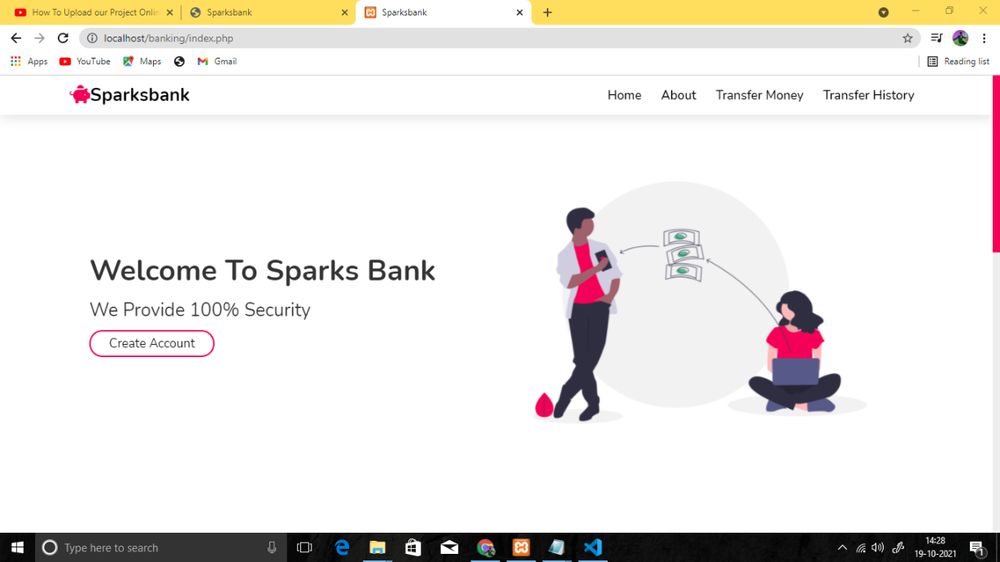
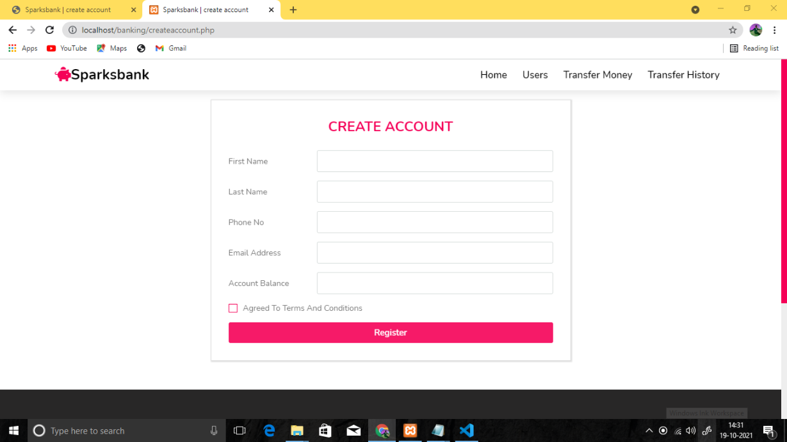
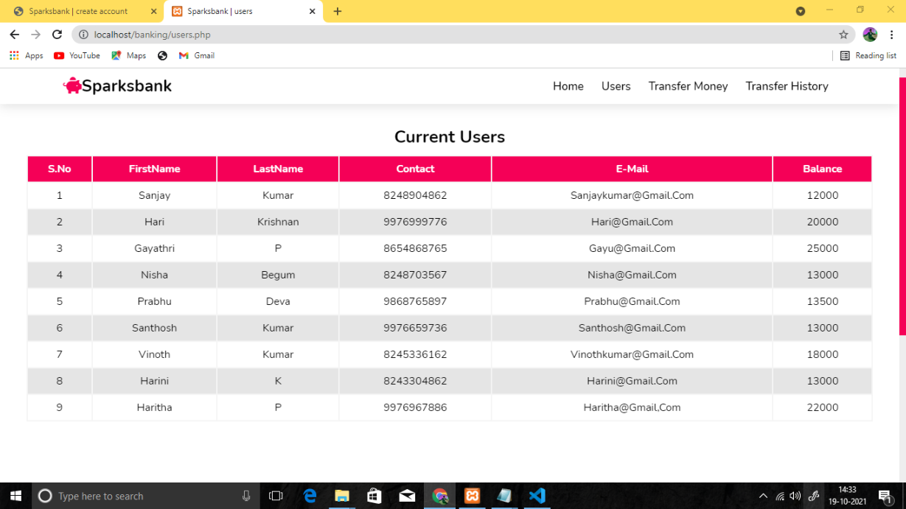
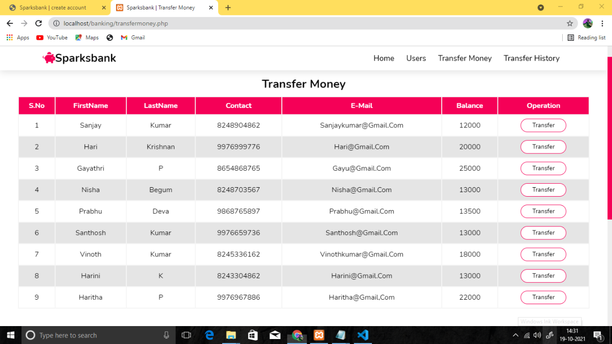
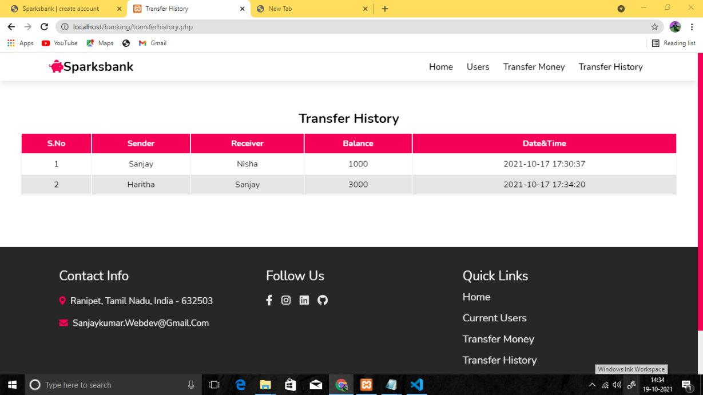

# Sparks bank
This is a Basic Banking website which i have been developed for my internship at The Sparks Foundation (#Task1).

Forntend : HTML, css, js
Backend  : PHP, MariaDB

Steps:

Step 1 : Install xampp or wampp .

Step 2 : Download the File and Extract to htdocs folder.

Step 3 : IMPORT Database on phpmyadmin.

Step 4 : Change the Database details.

Step 5 : Go to browser and search fpr "localhost/banking/index.php"

Website Link: https://thirdbaseme.000webhostapp.com/index.php

# Attached Files

Home page:

Create Account:

View users:

Transfer Money:

Transfer History:

